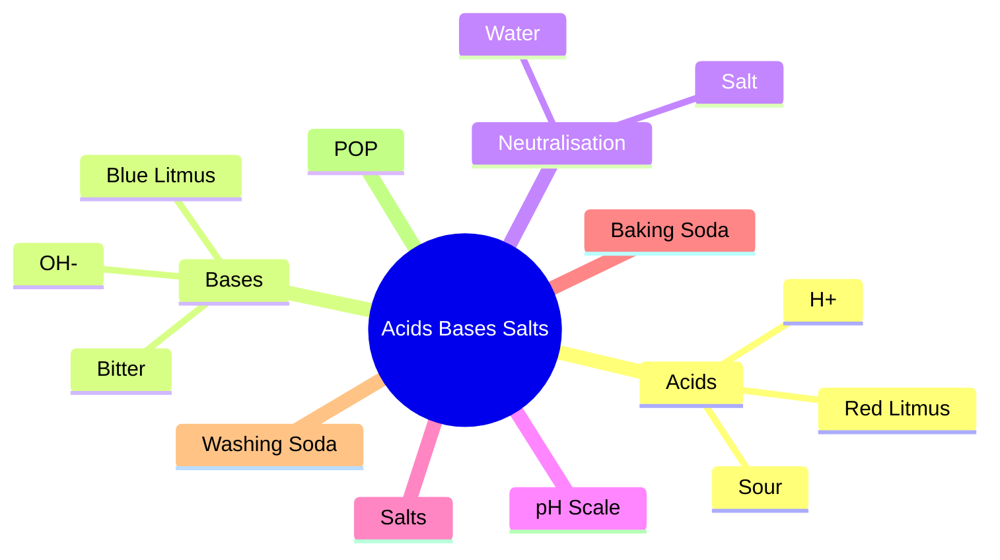

````markdown


# 🏰 Acids, Bases and Salts: The Chemistry Kingdom

Imagine a magical kingdom where three powerful groups live:

🟥 Acids Kingdom  
🟦 Bases Kingdom  
🟩 Salts Kingdom

Throughout this chapter, we will learn how these kingdoms interact, fight, cooperate, and transform.

---

# 🎯 Learning Objectives

After this lesson you can:

- Identify acids and bases
- Understand indicators
- Explain neutralisation
- Use pH scale
- Understand salts and their uses
- Solve board exam questions confidently

---

# Chapter Story Map



---

# 1. Meet the Acids

## 🍋 Analogy: Sour Superheroes

Think about:

- Lemon
- Tamarind
- Vinegar

All taste sour.

Acids are like superheroes carrying tiny hydrogen soldiers.

```text
Acid = H+ Army
```

Examples:

```text
HCl
H2SO4
HNO3
CH3COOH
```

NCERT explains that acidic nature is due to hydrogen ions produced in water. :contentReference[oaicite:0]{index=0}

---

## Visual

![Lemon and Vinegar]
IMAGE_URL_LEMON_VINEGAR

---

# 2. Meet the Bases

## 🧼 Analogy: Soap Kingdom

Bases are the cleaners of Chemistry Kingdom.

Examples:

```text
NaOH
KOH
Ca(OH)2
Mg(OH)2
```

They produce:

```text
OH-
```

ions in water. :contentReference[oaicite:1]{index=1}

---

## Visual

![Soap and Detergent]
IMAGE_URL_SOAP

---

# 3. Indicators: Chemistry Detectives

## 🕵️ Analogy

Imagine a detective who tells whether someone belongs to Acid Kingdom or Base Kingdom.

Indicators do exactly that.

---

## Litmus Detective

### Acid

```text
Blue → Red
```

### Base

```text
Red → Blue
```

:contentReference[oaicite:2]{index=2}

---

## SVG

```svg
<svg width="500" height="150">
<rect x="50" y="40" width="120" height="40" fill="blue"/>
<text x="80" y="65" fill="white">Blue Litmus</text>

<text x="210" y="65">→ Acid →</text>

<rect x="350" y="40" width="120" height="40" fill="red"/>
<text x="385" y="65" fill="white">Red Litmus</text>
</svg>
```

---

# 4. Acids + Metals

## ⚔️ Analogy: Metal Warriors

When Acid attacks a metal warrior:

```text
Acid + Metal
```

Hydrogen escapes.

```text
Acid + Metal
↓
Salt + Hydrogen
```

:contentReference[oaicite:3]{index=3}

---

## Example

```text
Zn + H2SO4
↓
ZnSO4 + H2
```

---

## Story

Metal says:

"Take my place Hydrogen!"

Hydrogen runs away as gas.

💨 POP sound

---

# 5. Acids + Carbonates

## 🥤 Analogy: Soda Bottle

When acid meets carbonate:

Fizz!

```text
Acid + Carbonate
↓
Salt + Water + CO2
```

:contentReference[oaicite:4]{index=4}

---

## Visual

```svg
<svg width="450" height="180">
<rect x="100" y="50" width="80" height="100" fill="#d0f0ff"/>
<circle cx="140" cy="40" r="8"/>
<circle cx="155" cy="25" r="6"/>
<circle cx="130" cy="15" r="4"/>
<text x="220" y="100">CO₂ Bubbles</text>
</svg>
```

---

# 6. Neutralisation

## 🤝 Analogy: Peace Treaty

Acid Kingdom and Base Kingdom stop fighting.

```text
Acid + Base
↓
Salt + Water
```

:contentReference[oaicite:5]{index=5}

---

## Example

```text
NaOH + HCl
↓
NaCl + H2O
```

---

## Story

Acid King 🤴

meets

Base Queen 👸

Instead of fighting,

they create:

🧂 Salt

💧 Water

---

# 7. Why Acids Conduct Electricity

## ⚡ Analogy: Mobile Network

Electricity needs carriers.

Acids release:

```text
H+
```

Bases release:

```text
OH-
```

These ions carry electricity. :contentReference[oaicite:6]{index=6}

---

# 8. pH Scale

## 🌡️ Analogy: Mood Meter

Imagine a mood scale.

```text
0 → Angry Acid
7 → Neutral
14 → Strong Base
```

---

## SVG

```svg
<svg width="700" height="100">

<rect x="20" y="20" width="220" height="40" fill="red"/>
<rect x="240" y="20" width="220" height="40" fill="yellow"/>
<rect x="460" y="20" width="220" height="40" fill="green"/>

<text x="90" y="45">Acid</text>
<text x="330" y="45">Neutral</text>
<text x="560" y="45">Base</text>

<text x="15" y="80">0</text>
<text x="345" y="80">7</text>
<text x="675" y="80">14</text>

</svg>
```

NCERT pH range: 0–14. :contentReference[oaicite:7]{index=7}

---

# 9. Importance of pH

## 🦷 Tooth Decay

When mouth pH drops below:

```text
5.5
```

teeth start getting damaged. :contentReference[oaicite:8]{index=8}

---

## 🐝 Bee Sting

Bee injects acid.

Apply baking soda.

Why?

Base neutralises acid. :contentReference[oaicite:9]{index=9}

---

## Image

![Bee Sting]
IMAGE_URL_BEE_STING

---

# 10. Family of Salts

## 👨‍👩‍👧 Analogy: Family Names

Like:

```text
Sharma Family
Reddy Family
Patel Family
```

Salts also belong to families.

Examples:

```text
NaCl
Na2SO4
```

Both belong to Sodium Family. :contentReference[oaicite:10]{index=10}

---

# 11. Common Salt Factory

## 🏭 Analogy: Mother Factory

Common Salt is the mother material.

Produces:

- NaOH
- Baking Soda
- Washing Soda
- Bleaching Powder

:contentReference[oaicite:11]{index=11}

---

# 12. Baking Soda

## 🎂 Analogy: Cake Balloon

When heated:

```text
NaHCO3
↓
CO2
```

CO₂ acts like balloons inside cake.

Cake becomes:

✅ Soft  
✅ Fluffy

:contentReference[oaicite:12]{index=12}

---

## Image

![Cake Rising]
IMAGE_URL_CAKE_RISING

---

# 13. Washing Soda

## 🧺 Analogy: Water Softener

Hard water is like tangled hair.

Washing soda untangles it.

Uses:

- Cleaning
- Glass industry
- Soap industry
- Water softening

:contentReference[oaicite:13]{index=13}

---

# 14. Water of Crystallisation

## 💎 Analogy: Hidden Water Backpack

Copper sulphate crystals look dry.

But secretly carry water.

```text
CuSO4·5H2O
```

Like a traveler carrying a backpack.

:contentReference[oaicite:14]{index=14}

---

## Visual

![Copper Sulphate Crystals]
IMAGE_URL_COPPER_SULPHATE

---

# 15. Plaster of Paris

## 🩹 Analogy: Doctor's Magic Cast

Broken bone?

POP saves the day.

```text
Gypsum
↓ Heat
POP
```

Add water:

```text
POP
↓
Hard Gypsum
```

:contentReference[oaicite:15]{index=15}

---

## Image

![Plaster Cast]
IMAGE_URL_PLASTER_CAST

---

# Memory Tricks

## Acids

```text
Sour
H+
Blue → Red
```

---

## Bases

```text
Bitter
OH-
Red → Blue
```

---

## Neutralisation

```text
Acid + Base
↓
Salt + Water
```

---

## pH

```text
<7 Acid

7 Neutral

>7 Base
```

---

# One Page Revision

| Concept | Analogy |
|----------|----------|
| Acid | Sour Superhero |
| Base | Soap Cleaner |
| Indicator | Detective |
| Neutralisation | Peace Treaty |
| pH | Mood Meter |
| Salt Family | Surname Family |
| Baking Soda | Cake Balloon |
| POP | Bone Doctor |

---

# Exam Formula Sheet

```text
Acid + Metal
→ Salt + Hydrogen

Acid + Carbonate
→ Salt + CO2 + Water

Acid + Base
→ Salt + Water

pH < 7 = Acid

pH = 7 = Neutral

pH > 7 = Base
```

# 🎯 Chapter Summary

Chemistry is not about memorising equations.

Think of:

- Acids as hydrogen armies
- Bases as cleaners
- Indicators as detectives
- pH as a mood scale
- Neutralisation as a peace treaty

and the entire chapter becomes a story.
````
