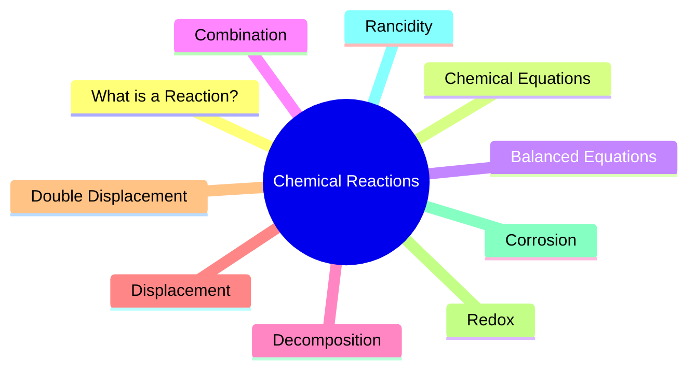

> Chemistry is like a city full of friendships, exchanges, breakups, and transformations.

## Chapter Map



---

## 1. What is a Chemical Reaction?
**Analogy:** LEGO City
🟥 + 🟦 → 🏠

When building blocks rearrange into something new, a new structure forms.

Similarly, in a chemical reaction, atoms rearrange to form new substances.

---

## 2. Signs of a Chemical Reaction
- Color change
- Gas formation
- Temperature change
- Change of state

**Analogy:** Birthday Party
* Balloons appear → Gas
* Room becomes warm → Heat
* Decorations change color → Color change

---

## 3. Chemical Equations
**Analogy:** Recipe Book
Instead of writing:
```text
Magnesium reacts with Oxygen to form Magnesium Oxide
```

Chemists write:
```text
Mg + O₂ → MgO
```

---

## 4. Balanced Chemical Equations
**Analogy:** School Bus Rule
If 10 students enter a bus, 10 students must come out. Atoms cannot be created or destroyed.

```svg
<svg width="300" height="80" viewBox="0 0 300 80" xmlns="http://www.w3.org/2000/svg">
  <rect x="10" y="15" width="100" height="50" rx="8" fill="#e2e8f0" stroke="#cbd5e1" stroke-width="2"/>
  <text x="60" y="45" font-family="sans-serif" font-size="14" font-weight="600" fill="#475569" text-anchor="middle">Reactants</text>
  
  <path d="M 130 40 L 170 40 L 160 32 M 170 40 L 160 48" stroke="#475569" stroke-width="3" fill="none"/>
  
  <rect x="190" y="15" width="100" height="50" rx="8" fill="#e2e8f0" stroke="#cbd5e1" stroke-width="2"/>
  <text x="240" y="45" font-family="sans-serif" font-size="14" font-weight="600" fill="#475569" text-anchor="middle">Products</text>
</svg>
```

---

## 5. Combination Reaction
**Analogy:** Marriage
👦 + 👧 → 👨‍👩‍👦

**Example:**
```text
CaO + H₂O → Ca(OH)₂
```
Two substances combine to form one product.

---

## 6. Exothermic Reaction
**Analogy:** Campfire
🔥 Wood burns and releases heat.

**Example:**
```text
CH₄ + O₂ → CO₂ + H₂O + Heat
```
Heat comes OUT.

---

## 7. Decomposition Reaction
**Analogy:** Breaking a LEGO Castle
🏰 → 🟥 🟦 🟨

**Example:**
```text
CaCO₃ → CaO + CO₂
```
One substance breaks into simpler substances.

---

## 8. Endothermic Reaction
**Analogy:** Charging a Phone
🔋 Electricity goes IN. Energy is required to make the reaction happen.

---

## 9. Displacement Reaction
**Analogy:** Stronger Player Takes the Position

**Example:**
```text
Fe + CuSO₄ → FeSO₄ + Cu
```
Iron replaces copper because it is more reactive.

---

## 10. Double Displacement Reaction
**Analogy:** Partner Swap Dance
* **Before:** A ♥ B  and  C ♥ D
* **After:** A ♥ D  and  C ♥ B

**Example:**
```text
Na₂SO₄ + BaCl₂ → BaSO₄ + NaCl
```
Ions exchange partners.

---

## 11. Oxidation and Reduction
* **Oxidation:** Gain oxygen.
  ```text
  Cu + O₂ → CuO
  ```
* **Reduction:** Lose oxygen.
  ```text
  CuO + H₂ → Cu + H₂O
  ```

**Memory Trick:**
```text
Oxidation = Gain Oxygen
Reduction = Lose Oxygen
```

---

## 12. Corrosion
**Analogy:** Metal Getting Sick
Shiny Iron → Rust (Rusting Iron)

---

## 13. Rancidity
**Analogy:** Old Chips Become Stale
* Fresh Chips 😊
* Old Chips 🤢 (Rancid Food)

*Nitrogen is filled in chips packets to prevent oxidation.*

---

## One-Page Revision Table

| Type | Analogy | Example |
| :--- | :--- | :--- |
| **Combination** | Marriage | CaO + H₂O |
| **Decomposition** | Breaking LEGO Castle | CaCO₃ → CaO + CO₂ |
| **Displacement** | Stronger Replaces Weaker | Fe + CuSO₄ |
| **Double Displacement** | Partner Swap | Na₂SO₄ + BaCl₂ |
| **Oxidation** | Gain Oxygen | Cu → CuO |
| **Reduction** | Lose Oxygen | CuO → Cu |
| **Exothermic** | Campfire | Respiration |
| **Endothermic** | Phone Charging | Electrolysis |

---

## Exam Memory Sheet
```text
COMBINATION = MANY → ONE
DECOMPOSITION = ONE → MANY
DISPLACEMENT = STRONGER REPLACES WEAKER
DOUBLE DISPLACEMENT = EXCHANGE
OXIDATION = GAIN OXYGEN
REDUCTION = LOSE OXYGEN
EXOTHERMIC = HEAT OUT
ENDOTHERMIC = HEAT IN
```
